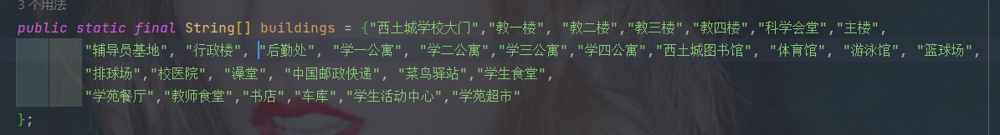

- 西土城校区的建筑物以下图为准

  - ###### 	

- 西土城校区的地图的建模：总共125条边
  - 

# 教学楼

- 教一楼
- 教二楼
- 教三楼
- 教四楼
- 主楼

# 办公楼

- 辅导员基地
- 行政楼
- 财务处后勤楼

# 宿舍楼

- 学一到学四

# 服务设施

- 图书馆
- 体育馆
- 游泳馆
- 校医院
- 澡堂
- 邮局
- 学生食堂
- 学苑餐厅
- 家属区

